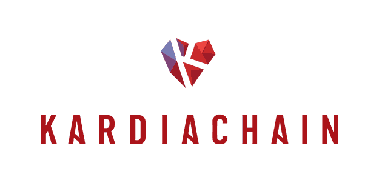

# Go-Kardia

[](https://github.com/kardiachain/go-kardia/releases/latest)
[](https://github.com/moovweb/gvm)
[](https://www.gnu.org/licenses/lgpl-3.0)
[](https://circleci.com/gh/kardiachain/go-kardia)
[](https://codecov.io/gh/kardiachain/go-kardia)

Official Golang implementation of KardiaChain following the specs
in [Technical Paper](https://dl.kardiachain.io/KardiaChain-WhitePaper-English.pdf)



### KardiaChain Aris Mainnet 1.0

- Network Explorer: [Aris Explorer](http://explorer.kardiachain.io/)

### KardiaChain Private Devnet
- Network Explorer: [Devnet Explorer](http://explorer-dev.kardiachain.io/)
- Release: [kardia-v1.1.0](https://github.com/kardiachain/go-kardia/releases/tag/v1.1.0)

## Quickstart

### Run Local Testnet with docker

- See [deplopyment/local](https://github.com/kardiachain/go-kardia/tree/master/deployment/local) for more details.

### Join Public Testnet

- See [deplopyment/testnet](https://github.com/kardiachain/go-kardia/tree/master/deployment/testnet) for more details.

### Join Mainnet

- See [deplopyment/mainnet](https://github.com/kardiachain/go-kardia/tree/master/deployment/mainnet) for more details.

## Development

### Go environment setup

Install [Go](https://golang.org/doc/install) to $HOME directory. Sets environment vars:
> export GOPATH=$HOME/go  
> export PATH=$PATH:$GOPATH/bin

- Recommend `go build` version: 1.14.12 (stable), 1.15.5 (unstable)
- Recommend `go test ./...` >= version: 1.14.12

### Installation Prerequisites

* Install [libzmq](https://github.com/zeromq/libzmq)

### Build

```
cd $GOPATH/src/github.com/kardiachain/go-kardia/cmd
go install
```

### Directory structure
Most of the top-level directories are self-explanatory. Here are the core directories:
* consensus - consensus engine
* config - default network configs
* dualchain - dual node's blockchain and service
* dualnode - interface layer to external blockchains, e.g. Ethererum, Neo, etc.
* kai - shared libraries specific to KardiaChain
* kvm - Kardia virtual machine
* lib - third-party libraries
* node - Node service
* rpc - RPC server
* mainchain - Kardia blockchain core and service
* proto - protobuf messages definition
* types - Kardia objects types


### Unit tests
```
cd $GOPATH/src/github.com/kardiachain/go-kardia
go test ./...
```

### Start Kardia network

#### Mainnet

- See [deplopyment/mainnet](https://github.com/kardiachain/go-kardia/tree/master/deployment/mainnet) for more details.

#### Testnet Fengari 3.0
```
./cmd --network testnet --node <path/to/kai_config_testnet.yaml>
```

#### Devnet
```
./cmd --network devnet --node <path/to/kai_config_devnet_node1.yaml>
./cmd --network devnet --node <path/to/kai_config_devnet_node2.yaml>
./cmd --network devnet --node <path/to/kai_config_devnet_node3.yaml>
```

### Monitor network with KardiaChain Explorer

- Setup [JSON-RPC](https://github.com/kardiachain/go-kardia/tree/master/rpc) request
- Launch [Explorer Backend](https://github.com/kardiachain/explorer-backend) (publication soon)
